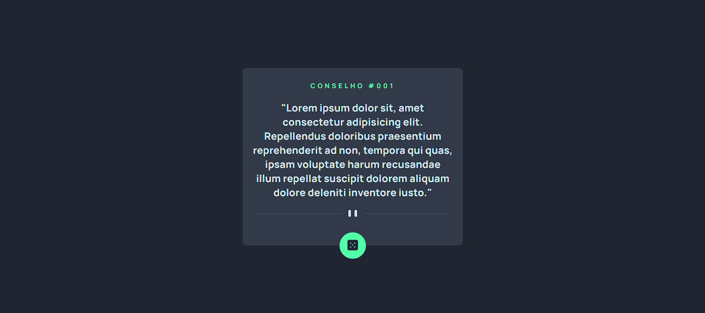

<h1 align="center"> Exercício Gerador de Conselho </h1>

### Descrição do projeto: Atualizado
- O principal desafio é construir um aplicativo que gere conselhos aleatórios. Nessa primeira etapa do exercício, será realizado apenas a construção do HTML e CSS.
- Criação do JavaScript para atualizar os conselhos

### Design do projeto:
- Desktop:

- Mobile

#### Status do projeto: Finalizado
- Criado o javascript para atualizar os conselhos e gerar novos aleátoriamente.

#### Tecnologias utilizadas:
- HTML5
- CSS3
- JavaScript

#### API utilizada no projeto:
- Advice Slip JSON API